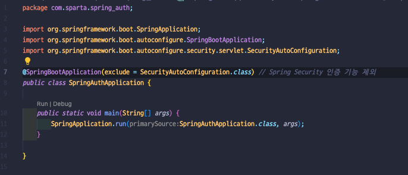
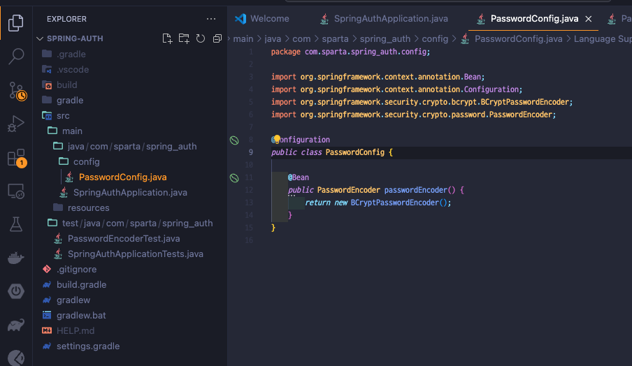
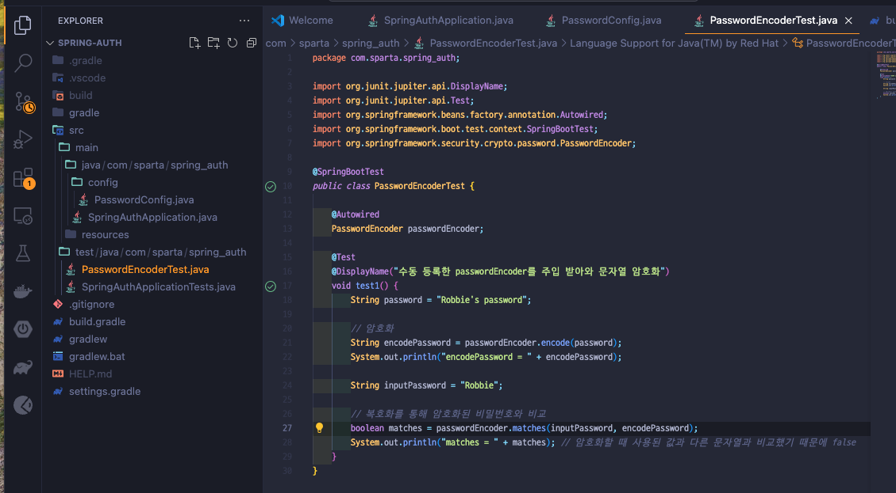
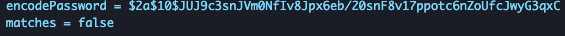

## Version 0.1.1
> Bean을 수동으로 등록하는 방법

### 새로운 프로젝트 생성하기
- Name: spring-auth
- **Language: Java**
- **Build system: Gradle - Groovy**
- Group: com.sparta
- **JDK: 17**

### 프로젝트 설정
* Spring web
* Lombok
* thymlef
* Security
```
implementation 'org.springframework.boot:spring-boot-starter-security'
```

### Security 기능 제한하는법
* SpringAuthApplication.java 폴더에 아래코드 추가
```
package com.sparta.springauth;

import org.springframework.boot.SpringApplication;
import org.springframework.boot.autoconfigure.SpringBootApplication;
import org.springframework.boot.autoconfigure.security.servlet.SecurityAutoConfiguration;

@SpringBootApplication(exclude = SecurityAutoConfiguration.class) // Spring Security 인증 기능 제외
public class SpringAuthApplication {

    public static void main(String[] args) {
        SpringApplication.run(SpringAuthApplication.class, args);
    }

}
```

### config폴더 생성 후 PasswordConfig.java 파일 생성


### test 해보기 
#### test 파일 PasswordConfigTest.java 파일 생성


* test 성공 후 출력 값
