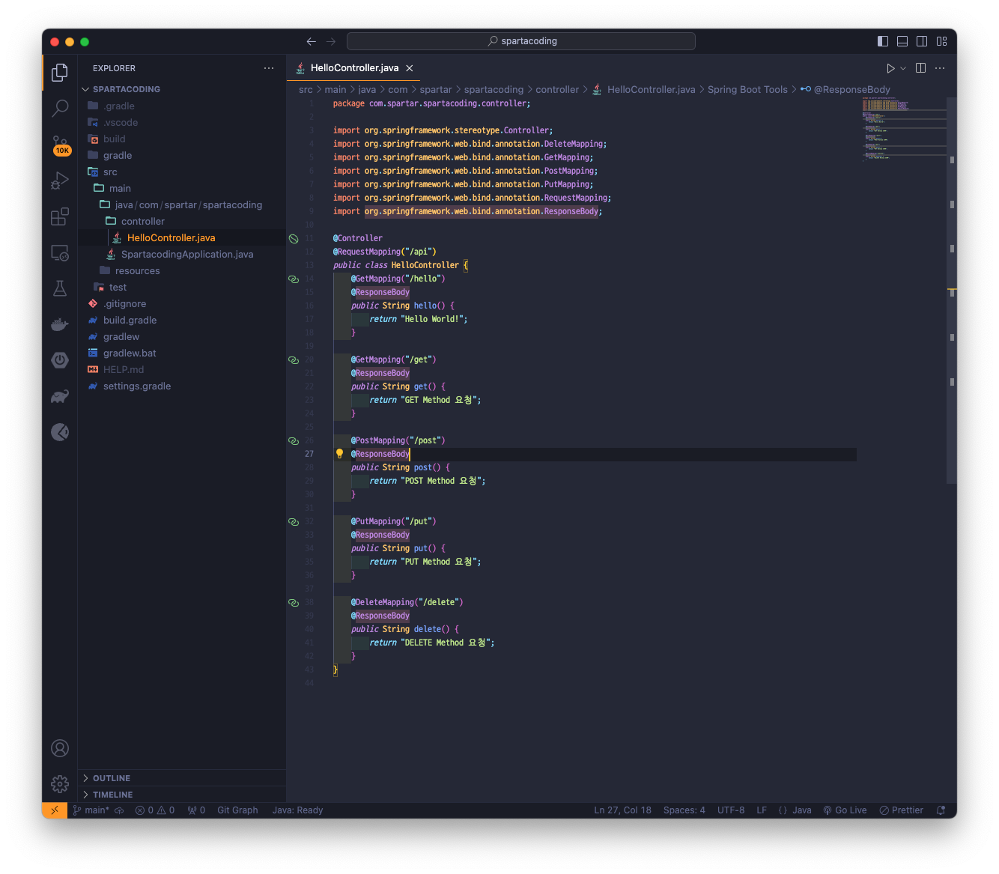
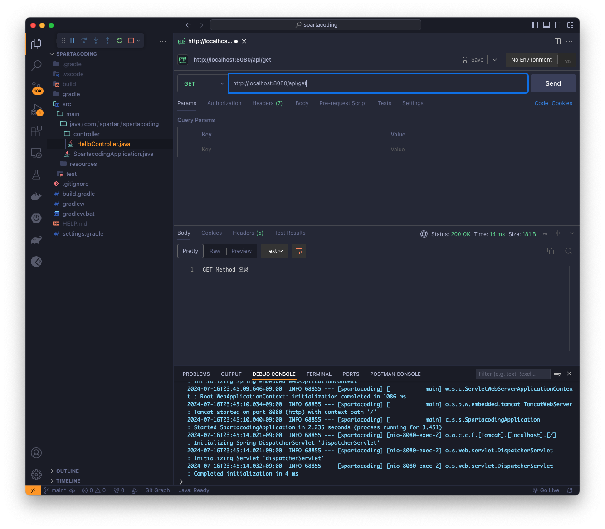
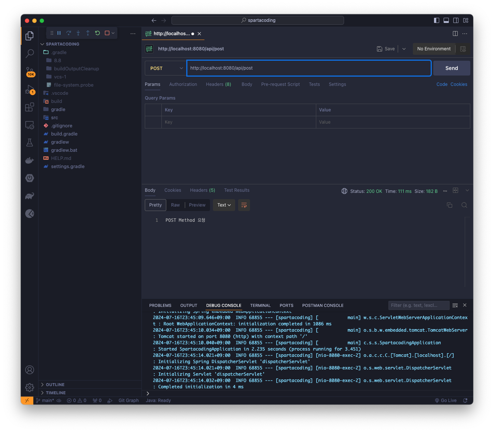
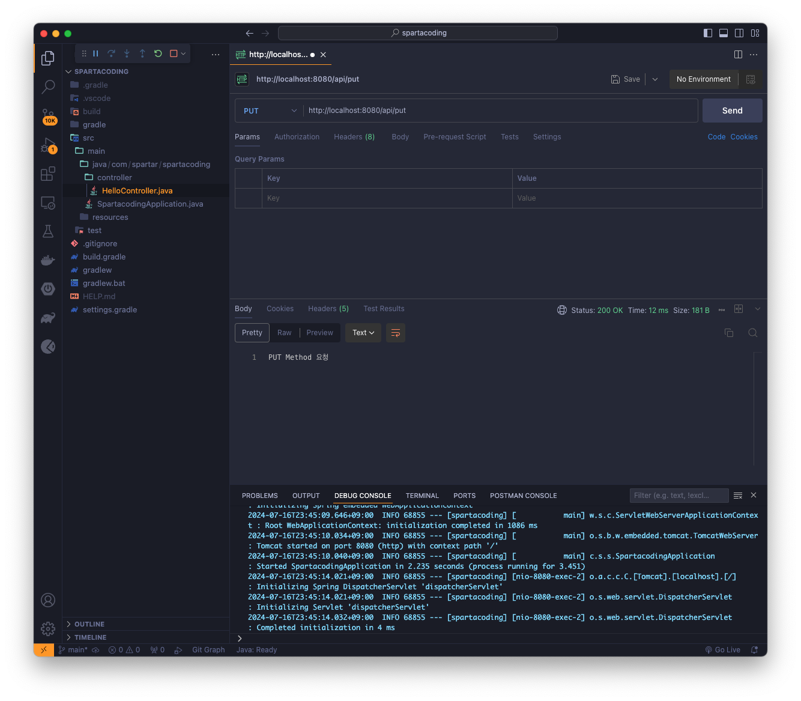
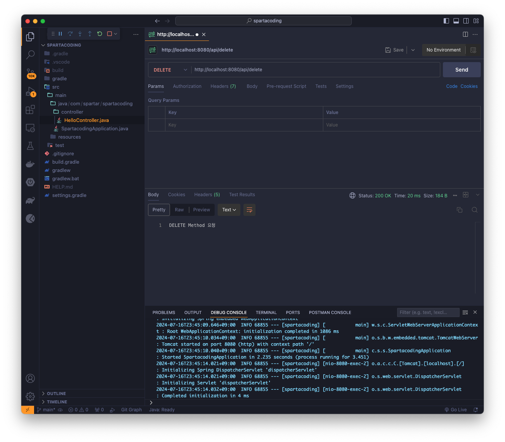

## Version 0.0.4
> GetMapping, PostMapping, PutMapping, DeleteMapping 생성 후 Postman으로 test 진행

### HelloController.java 파일 생성하기

### Postman test - get

### Postman test - post

### Postman test - put

### Postman test - delete

