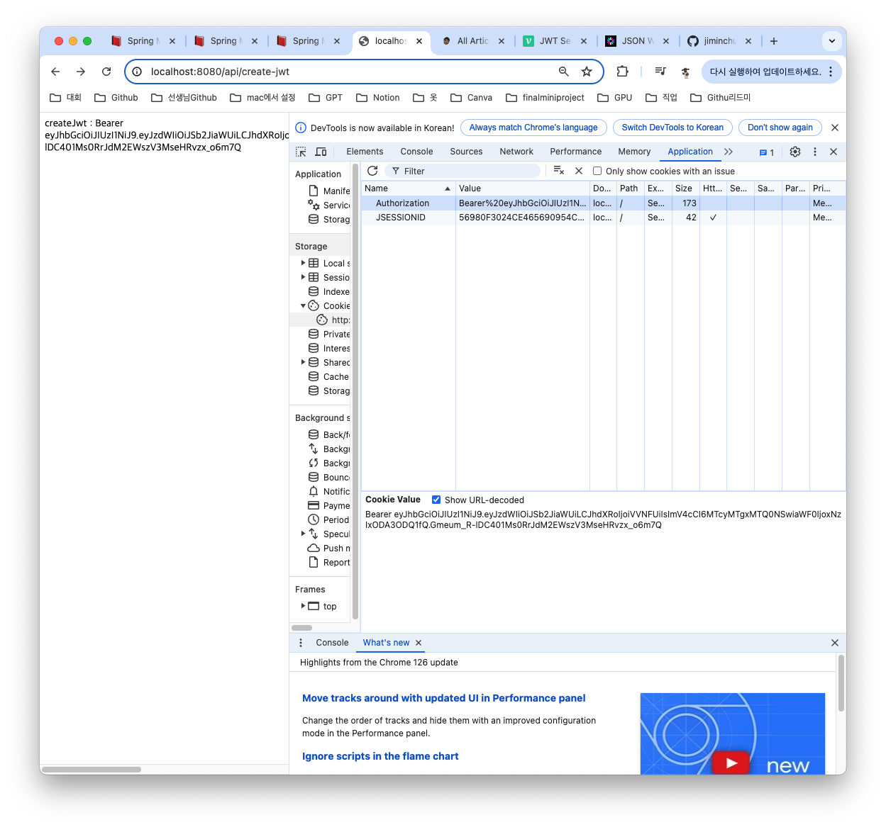
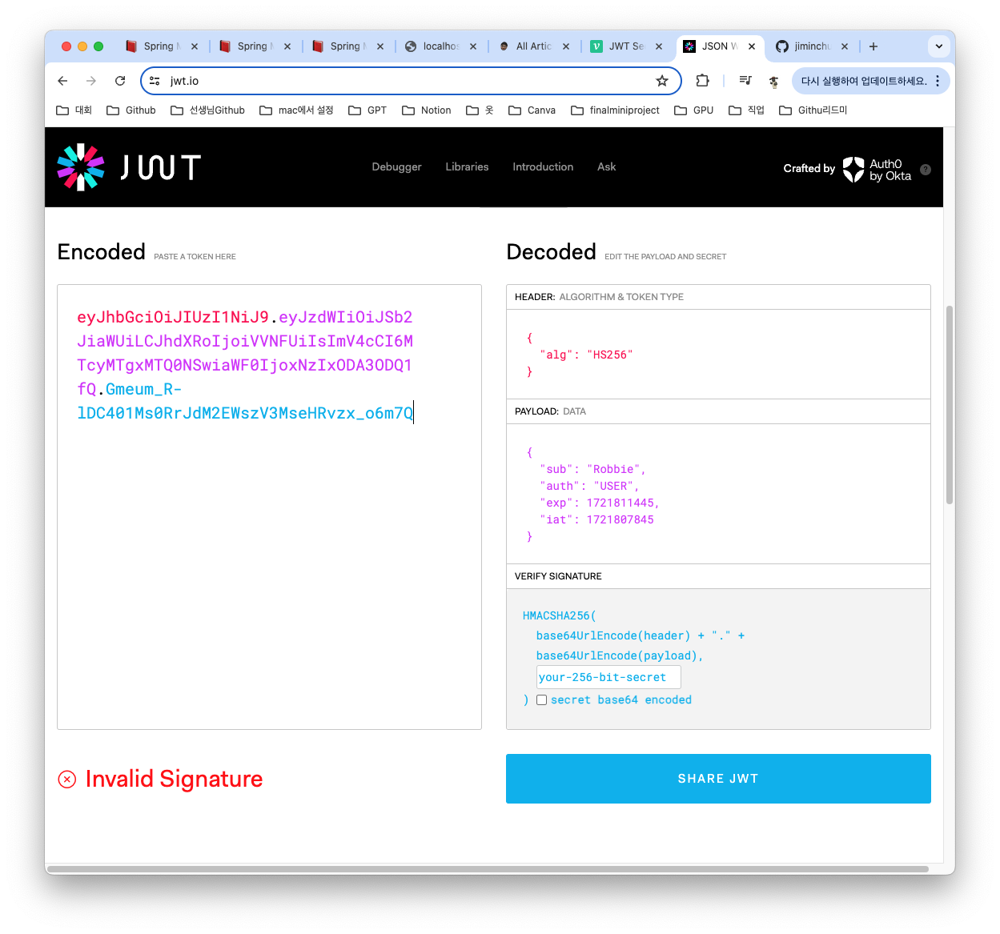

## Version 0.1.4
> JWT 다뤄보기

### build.gradle에 JWT dependency 추가하기
```
// JWT
compileOnly group: 'io.jsonwebtoken', name: 'jjwt-api', version: '0.11.5'
runtimeOnly group: 'io.jsonwebtoken', name: 'jjwt-impl', version: '0.11.5'
runtimeOnly group: 'io.jsonwebtoken', name: 'jjwt-jackson', version: '0.11.5'
```
### application.properties에 jwt.secret.key 등록하기
```
jwt.secret.key=7Iqk7YyM66W07000000000000000000000000000==
```
### JwtUtil 만들기
#### jwt 폴더 생성 후 JwtUtil.java 파일 생성하기
1. 토큰 생성에 필요한 데이터 생성 및 UserRoleEnum.java파일 생성하기
```
// Header KEY 값
public static final String AUTHORIZATION_HEADER = "Authorization";
// 사용자 권한 값의 KEY
public static final String AUTHORIZATION_KEY = "auth";
// Token 식별자
public static final String BEARER_PREFIX = "Bearer ";
// 토큰 만료시간
private final long TOKEN_TIME = 60 * 60 * 1000L; // 60분

@Value("${jwt.secret.key}") // Base64 Encode 한 SecretKey
private String secretKey;
private Key key;
private final SignatureAlgorithm signatureAlgorithm = SignatureAlgorithm.HS256;

// 로그 설정
public static final Logger logger = LoggerFactory.getLogger("JWT 관련 로그");

@PostConstruct
public void init() {
    byte[] bytes = Base64.getDecoder().decode(secretKey);
    key = Keys.hmacShaKeyFor(bytes);
}
```
* 사용자의 권한의 종류를 Enum을 사용해서 관리합니다.
    * JWT를 생성할 때 사용자의 정보로 해당 사용자의 권한을 넣어줄 때 사용합니다.
```
public enum UserRoleEnum {
    USER(Authority.USER),  // 사용자 권한
    ADMIN(Authority.ADMIN);  // 관리자 권한

    private final String authority;

    UserRoleEnum(String authority) {
        this.authority = authority;
    }

    public String getAuthority() {
        return this.authority;
    }

    public static class Authority {
        public static final String USER = "ROLE_USER";
        public static final String ADMIN = "ROLE_ADMIN";
    }
}
```
2. JWT 생성
```
// 토큰 생성
public String createToken(String username, UserRoleEnum role) {
    Date date = new Date();

    return BEARER_PREFIX +
            Jwts.builder()
                    .setSubject(username) // 사용자 식별자값(ID)
                    .claim(AUTHORIZATION_KEY, role) // 사용자 권한
                    .setExpiration(new Date(date.getTime() + TOKEN_TIME)) // 만료 시간
                    .setIssuedAt(date) // 발급일
                    .signWith(key, signatureAlgorithm) // 암호화 알고리즘
                    .compact();
}
```
3. JWT Cookie에 저장
```
// JWT Cookie 에 저장
public void addJwtToCookie(String token, HttpServletResponse res) {
    try {
        token = URLEncoder.encode(token, "utf-8").replaceAll("\\+", "%20"); // Cookie Value 에는 공백이 불가능해서 encoding 진행

        Cookie cookie = new Cookie(AUTHORIZATION_HEADER, token); // Name-Value
        cookie.setPath("/");

        // Response 객체에 Cookie 추가
        res.addCookie(cookie);
    } catch (UnsupportedEncodingException e) {
        logger.error(e.getMessage());
    }
}
```
4. 받아온 Cookie의 Value인 JWT 토큰 substring
```
// JWT 토큰 substring
public String substringToken(String tokenValue) {
    if (StringUtils.hasText(tokenValue) && tokenValue.startsWith(BEARER_PREFIX)) {
        return tokenValue.substring(7);
    }
    logger.error("Not Found Token");
    throw new NullPointerException("Not Found Token");
}
```
5. JWT 검증
```
// 토큰 검증
public boolean validateToken(String token) {
    try {
        Jwts.parserBuilder().setSigningKey(key).build().parseClaimsJws(token);
        return true;
    } catch (SecurityException | MalformedJwtException | SignatureException e) {
        logger.error("Invalid JWT signature, 유효하지 않는 JWT 서명 입니다.");
    } catch (ExpiredJwtException e) {
        logger.error("Expired JWT token, 만료된 JWT token 입니다.");
    } catch (UnsupportedJwtException e) {
        logger.error("Unsupported JWT token, 지원되지 않는 JWT 토큰 입니다.");
    } catch (IllegalArgumentException e) {
        logger.error("JWT claims is empty, 잘못된 JWT 토큰 입니다.");
    }
    return false;
}
```
6. JWT에서 사용자 정보 가져오기
```
// 토큰에서 사용자 정보 가져오기
public Claims getUserInfoFromToken(String token) {
    return Jwts.parserBuilder().setSigningKey(key).build().parseClaimsJws(token).getBody();
}
```

### JWT 테스트
#### /create-jwt
```
@GetMapping("/create-jwt")
public String createJwt(HttpServletResponse res) {
    // Jwt 생성
    String token = jwtUtil.createToken("Robbie", UserRoleEnum.USER);

    // Jwt 쿠키 저장
    jwtUtil.addJwtToCookie(token, res);

    return "createJwt : " + token;
}
```

#### /get-jwt
```
@GetMapping("/get-jwt")
public String getJwt(@CookieValue(JwtUtil.AUTHORIZATION_HEADER) String tokenValue) {
    // JWT 토큰 substring
    String token = jwtUtil.substringToken(tokenValue);

    // 토큰 검증
    if(!jwtUtil.validateToken(token)){
        throw new IllegalArgumentException("Token Error");
    }

    // 토큰에서 사용자 정보 가져오기
    Claims info = jwtUtil.getUserInfoFromToken(token);
    // 사용자 username
    String username = info.getSubject();
    System.out.println("username = " + username);
    // 사용자 권한
    String authority = (String) info.get(JwtUtil.AUTHORIZATION_KEY);
    System.out.println("authority = " + authority);

    return "getJwt : " + username + ", " + authority;
}
```

#### jwt.io에서 인코딩된 값 확인해보기
