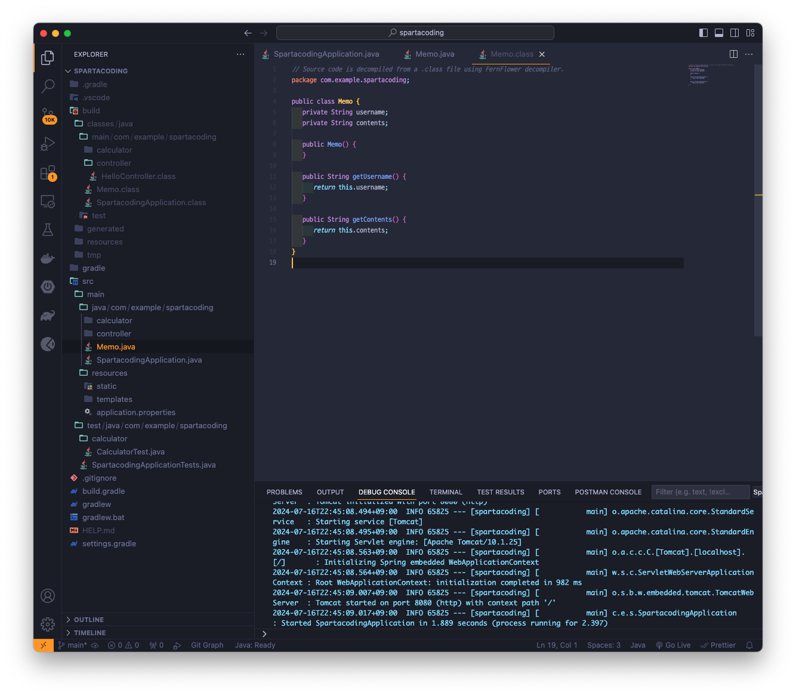
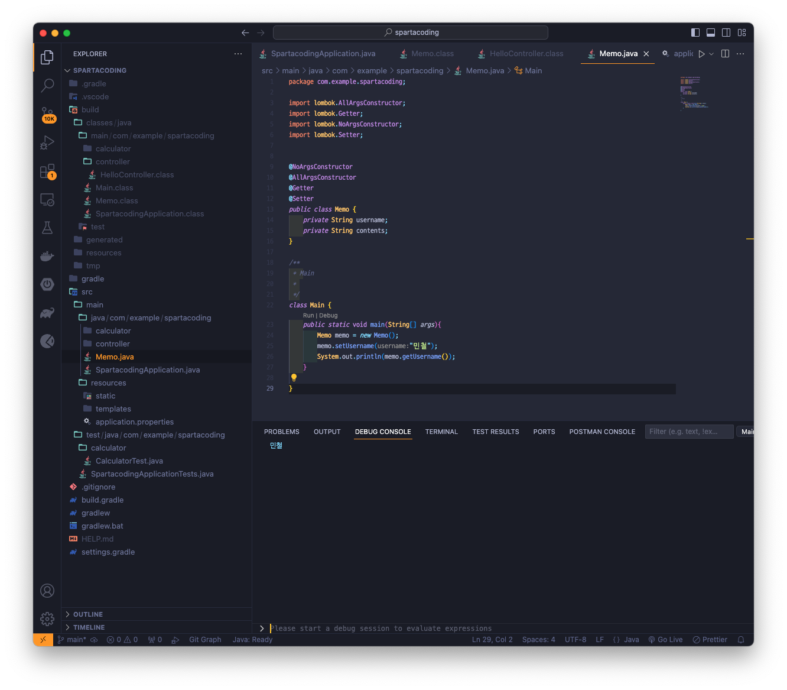
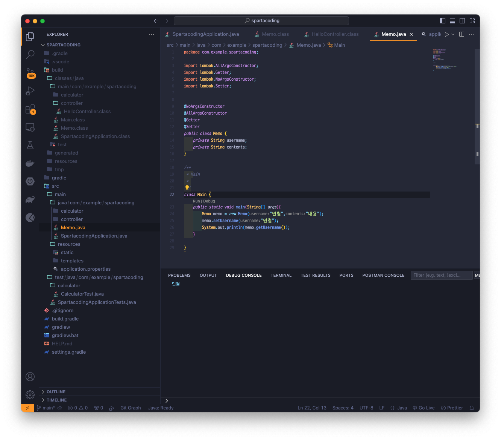
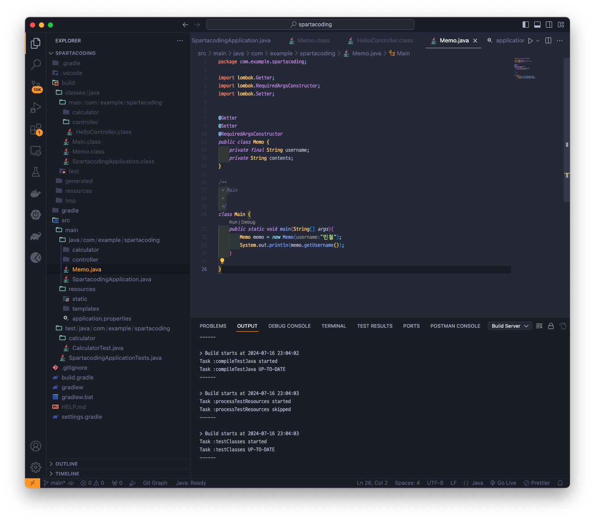
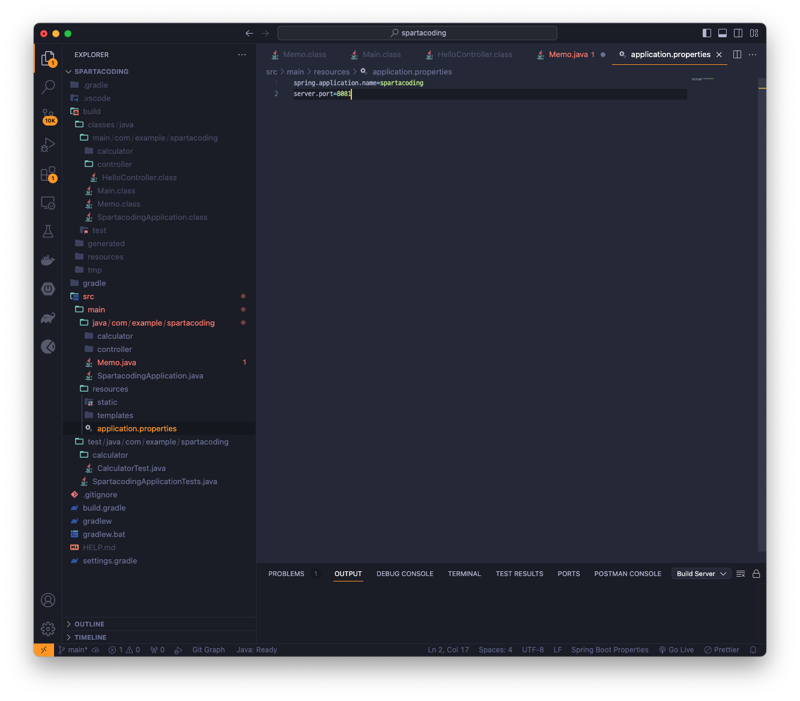
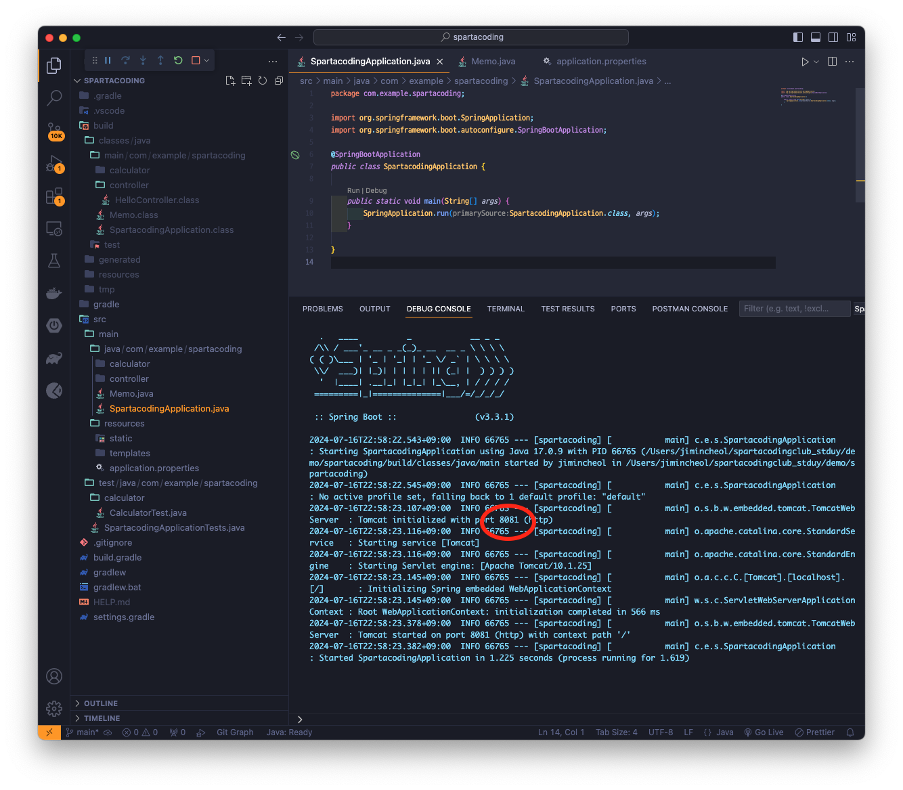

## Version 0.0.3
> @getter @setter @AllArgsConstructor @NoArgsConstructor @RequiredArgsConstructor 다뤄보기 및 application.properties 파일에서 port 수정해보기

### Memo.java 생성 후 getter setter 적용하기

### getter setter가 생성되는 memo.class 파일 체크하기

* setUsername()은 적용은 되나 class파일에서는 식별이 되질않음

### NoArgsConstructor

### AllArgsConstructor

### RequiredArgsConstructor

### application.properties에서 Port번호 수정해보고 확인하기
* application.properties에서 수정

* 실행 후 port번호 확인
