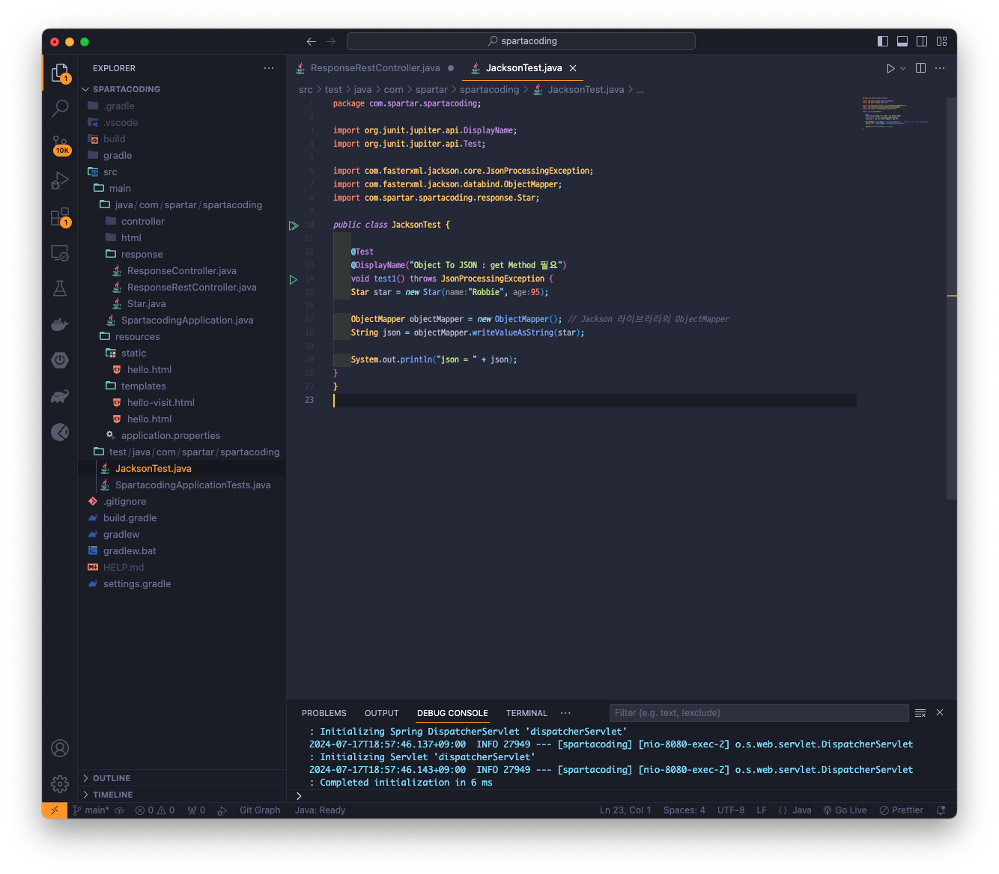
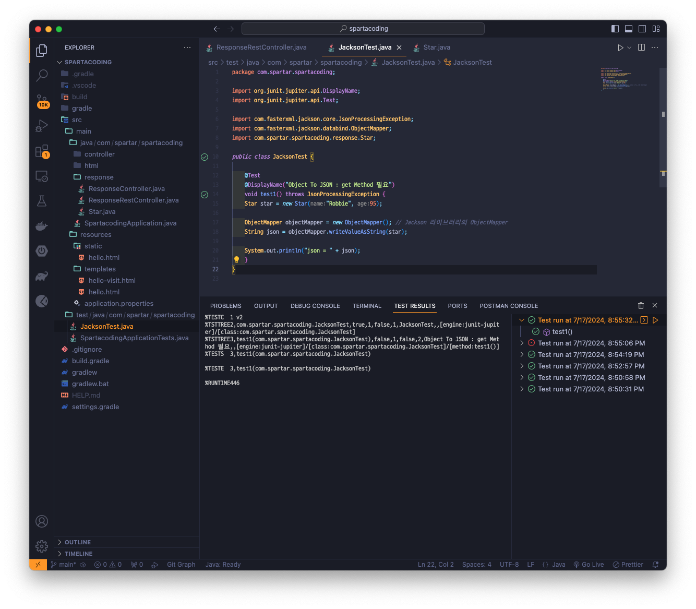
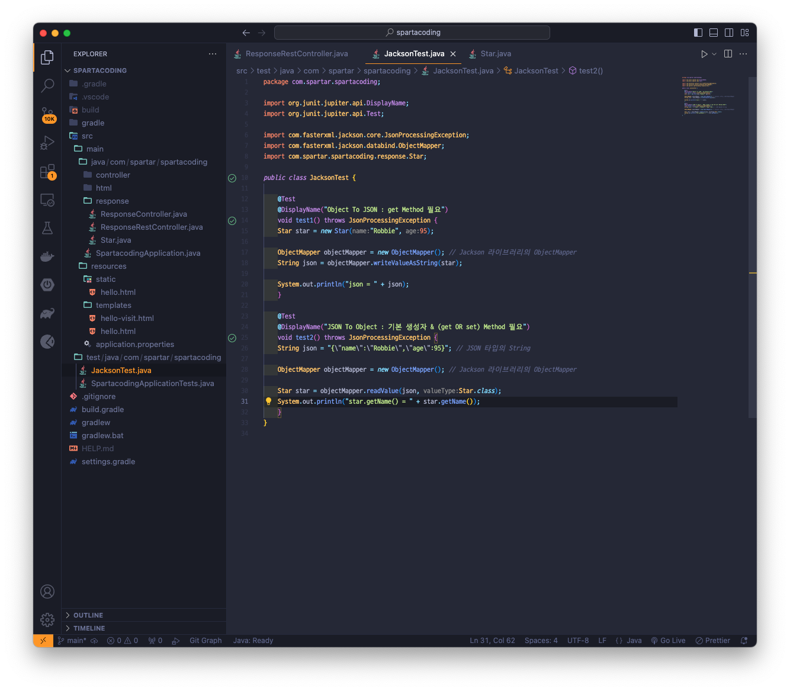
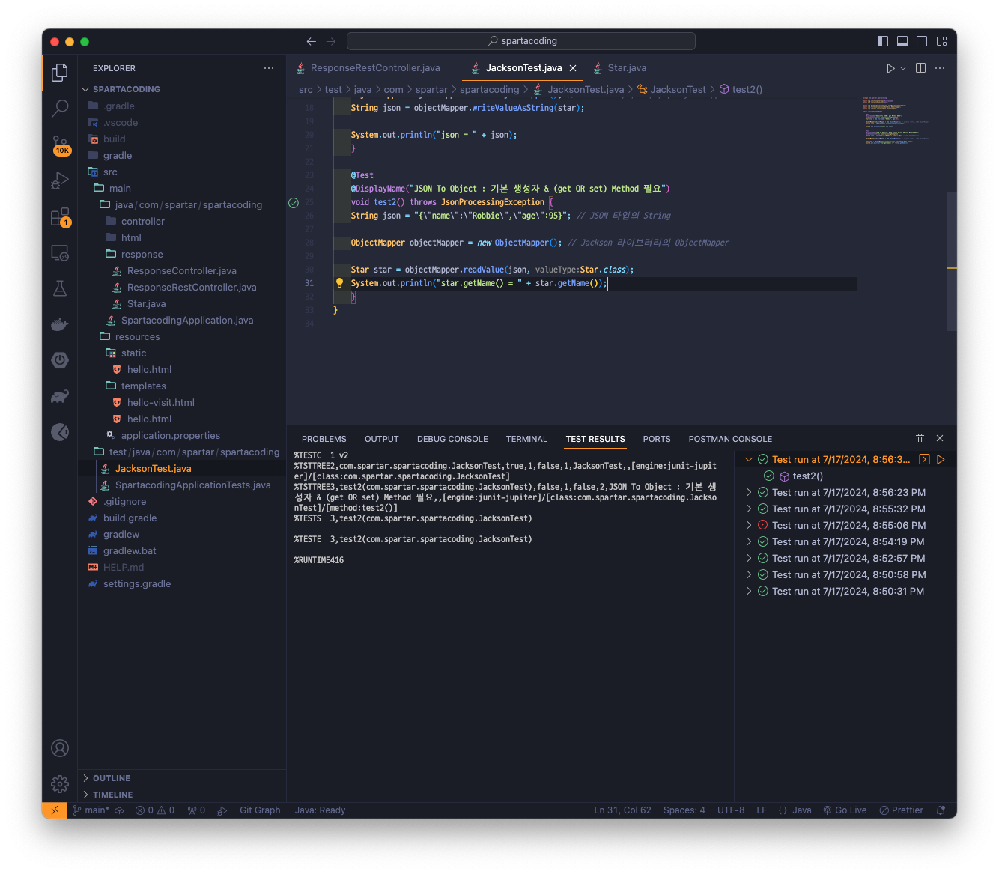
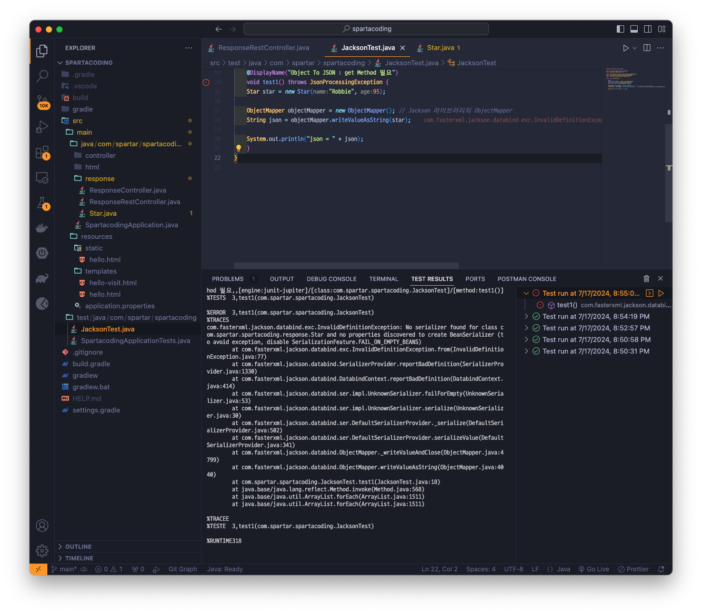

## Version 0.0.7
> Jackson 실습하기

### Object를 Json으로 변환시키기

### Object를 Json으로 변환 Test

### Json를 Object으로 변환시키기

### Json를 Object으로 변환 Test
* 성공

#### Star.java파일의 @Getter를 주석처리 해보고 Test 해보기
* 실패

