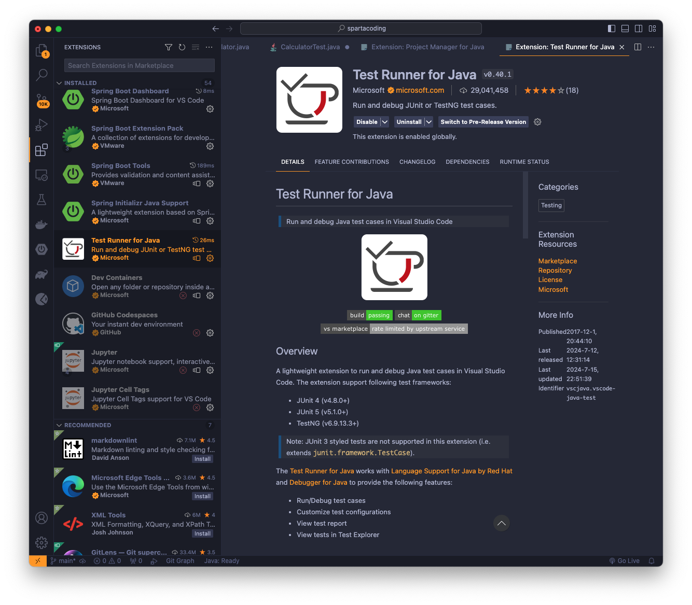
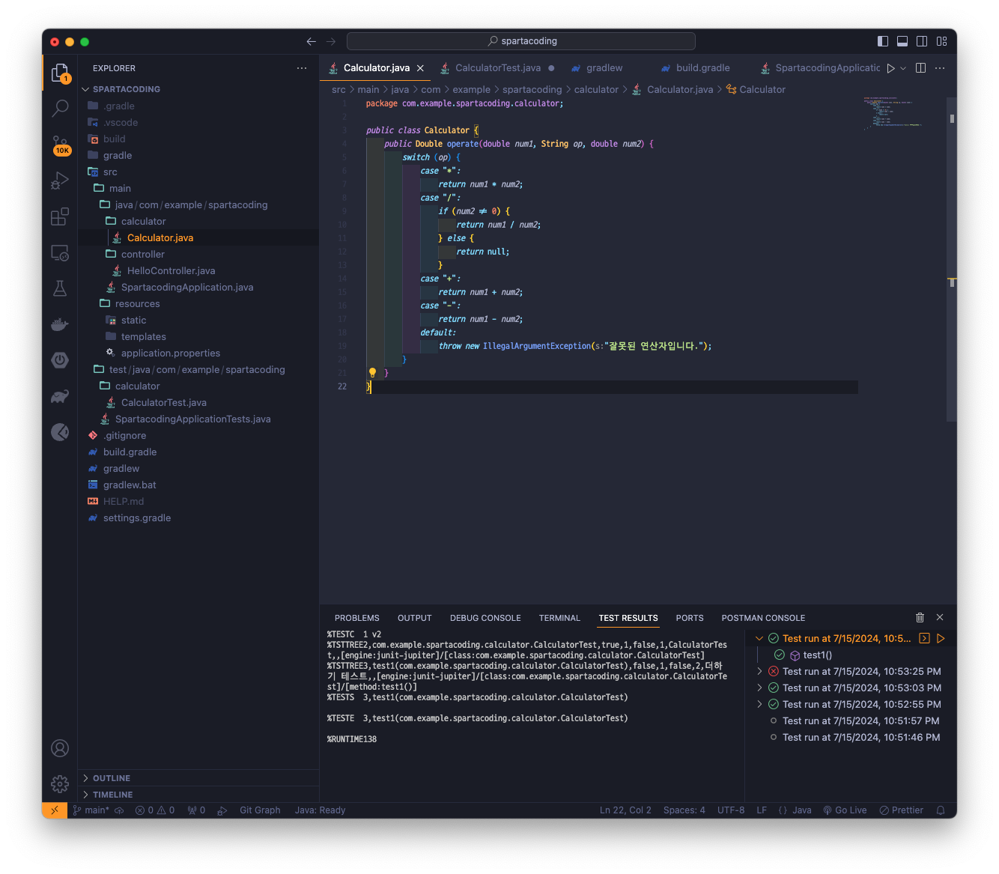
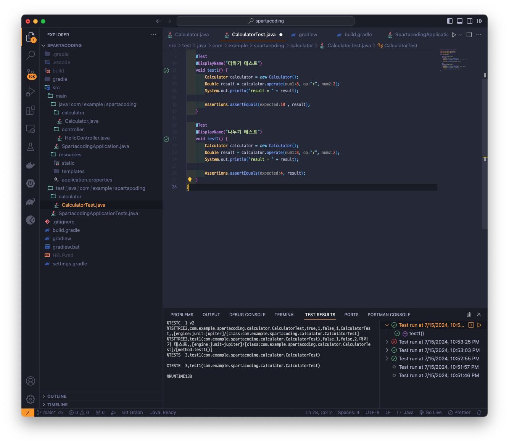
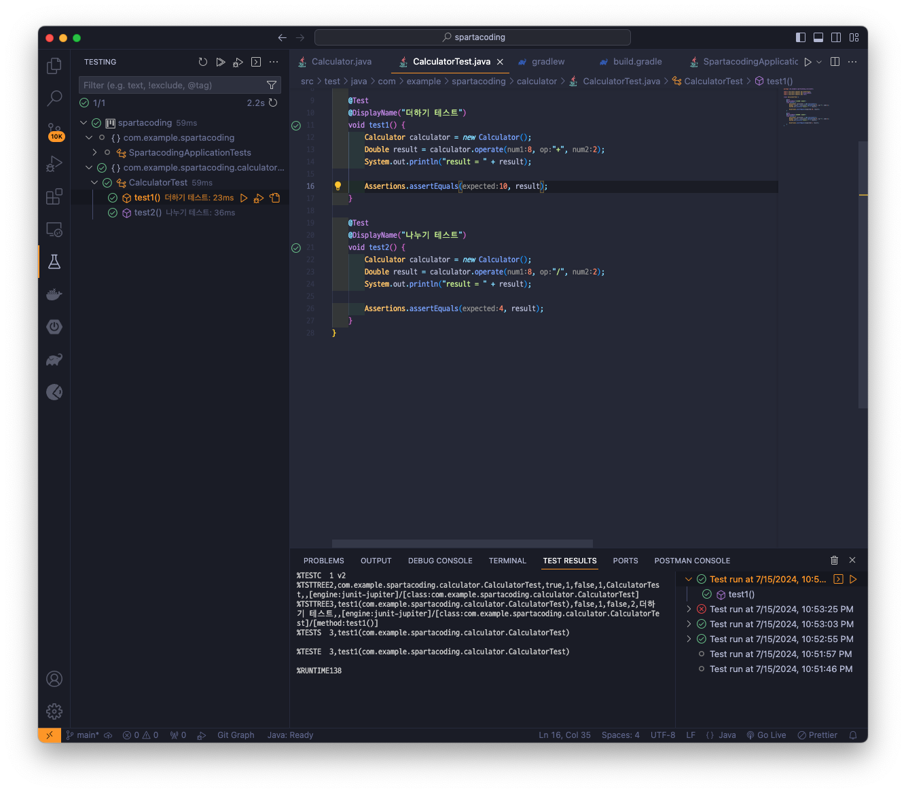
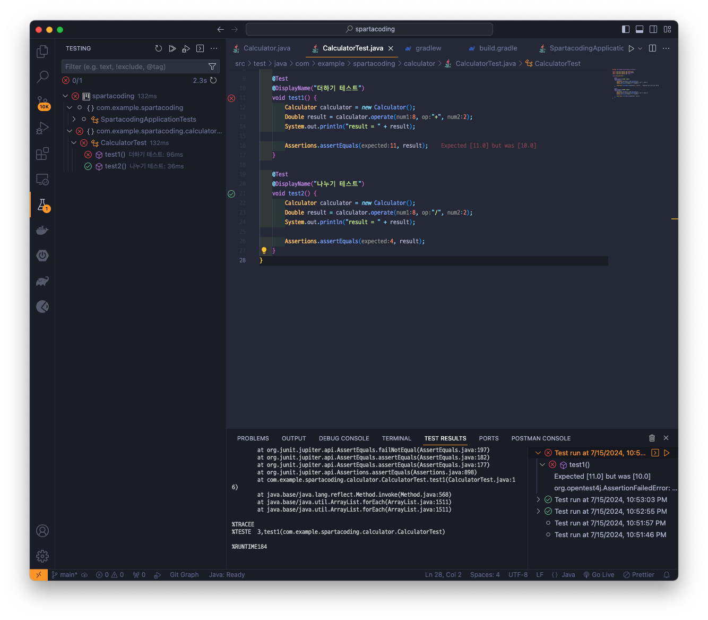

## Version 0.0.2
> Spring에서 '테스트 코드' 작성 후 실행해보기

### Visual Studio Code에서 test를 도와주는 extention 설치하기

### 1. 계산기 java 파일 적용하기

### 2. test 폴더에도 위치는 그대로 적용해서 생성하고 파일 이름만 뒤에 Test를 붙혀주기

### test 진행 - 성공 하였을 때

### test 진행 - 실패 하였을 때
