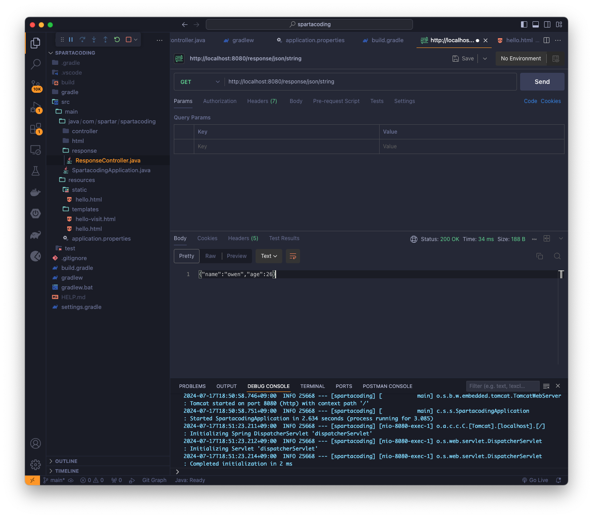
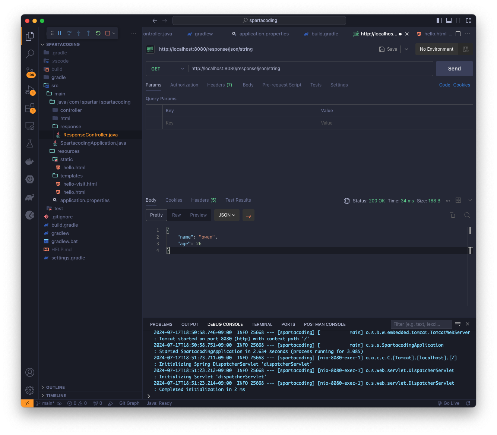
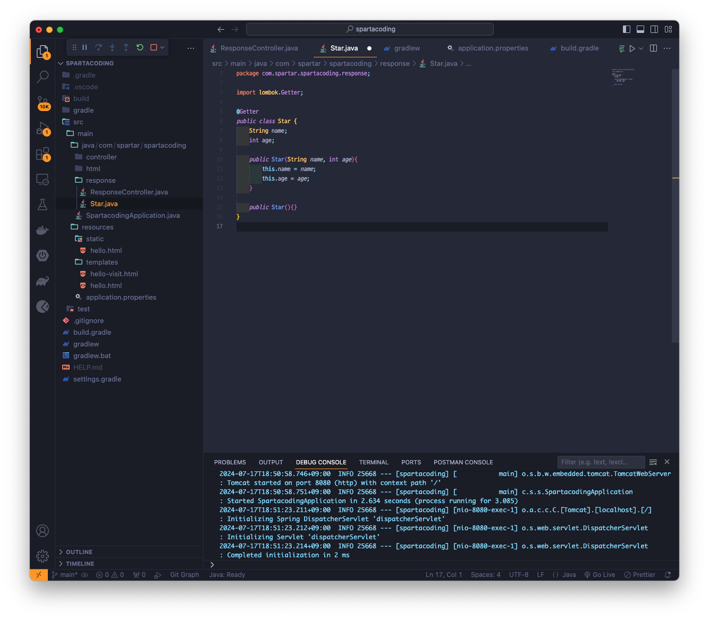
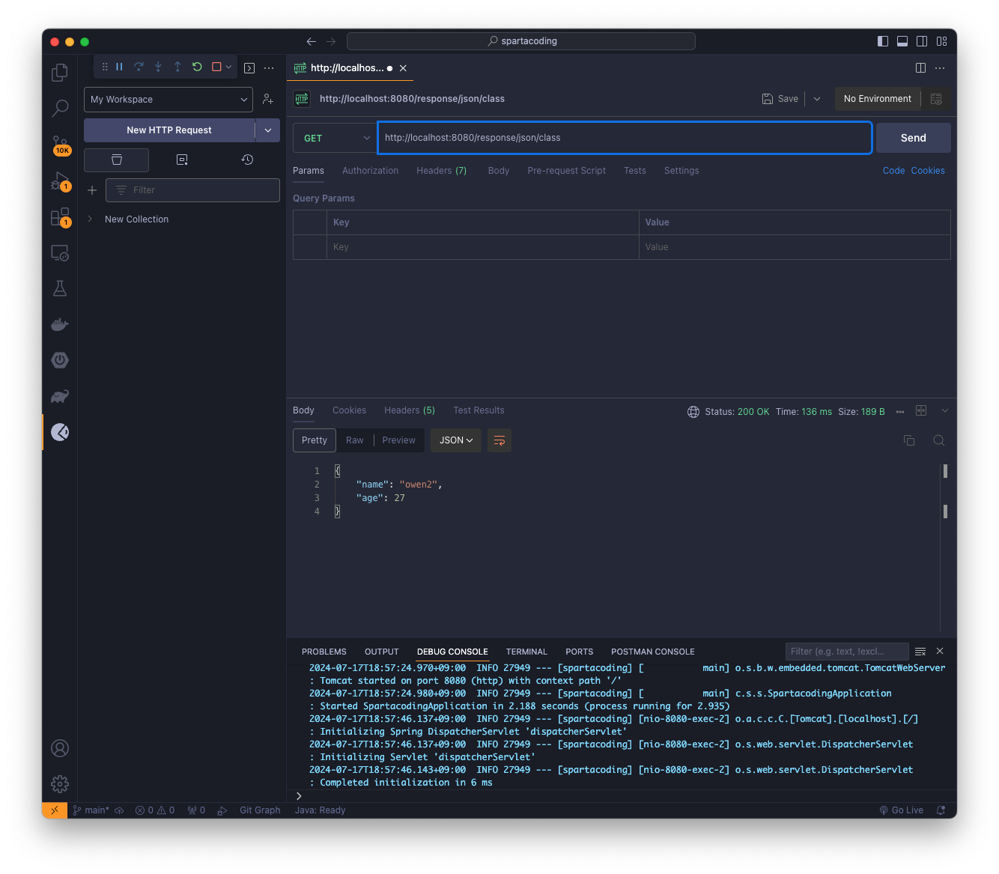
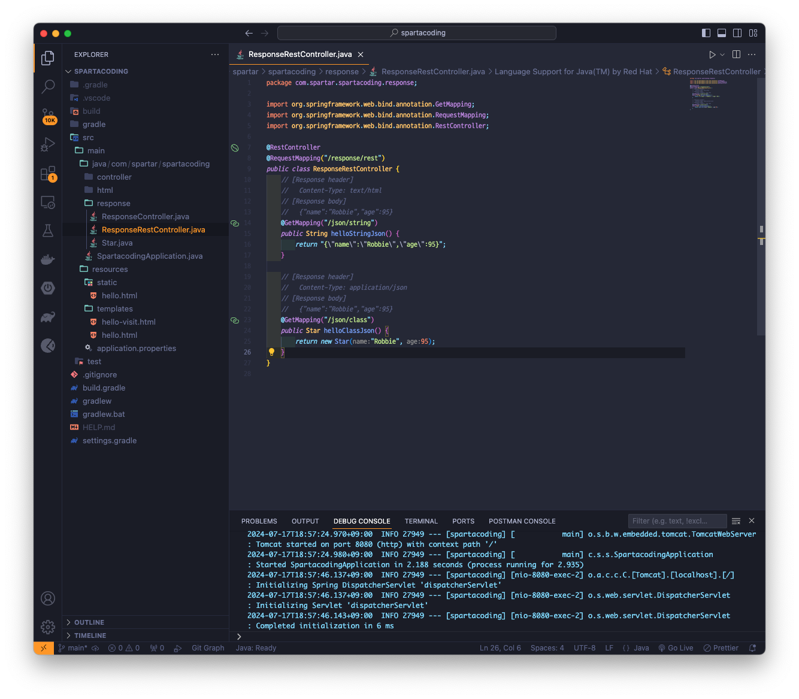

## Version 0.0.6
> 데이터를 Client에 반환하는 방법

### Json 데이터 반환하는 방법 (반환값 : String)

#### Postman test - 결과값 text로 보기

#### Postman test - 결과값 json로 보기

### Json 데이터 반환하는 방법 (반환값 : String 외 자바 클래스)

#### Star.java

#### Postman test

### @RestController로 수정해서 파일 생성
* RestController는 Controller + ResponseBody라고 생각하면 된다. 사용하게되면 해당 클래스의 모든 메서드에 @ResponseBody 애너테이션이 추가되는 효과를 부여할 수 있다.
