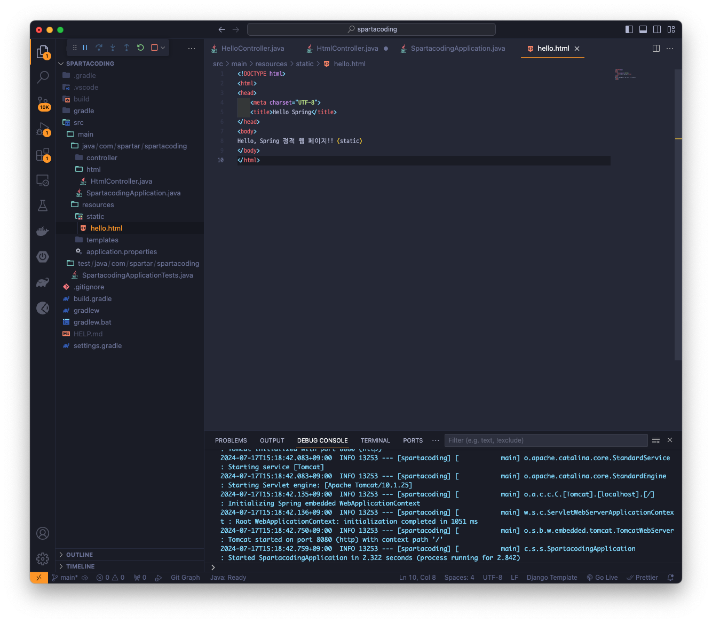
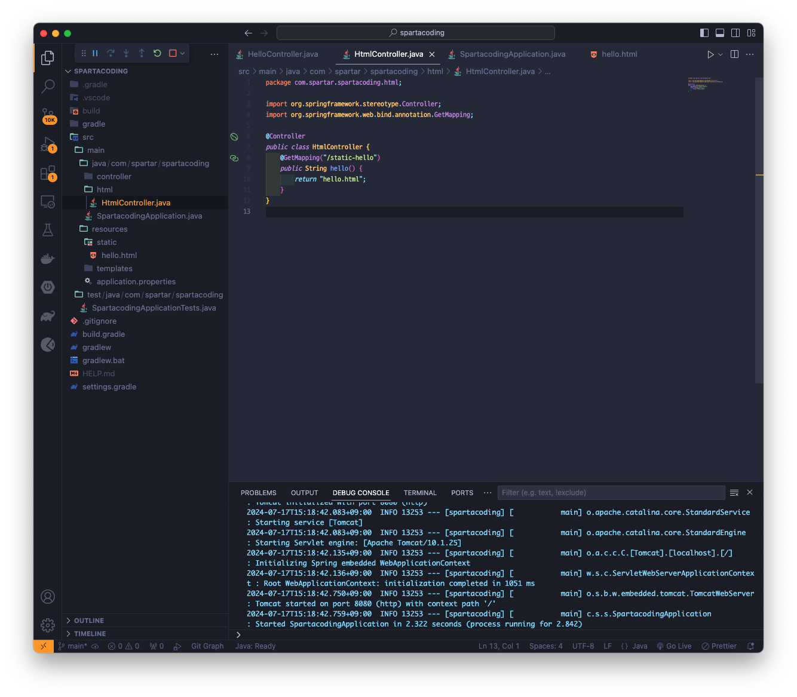
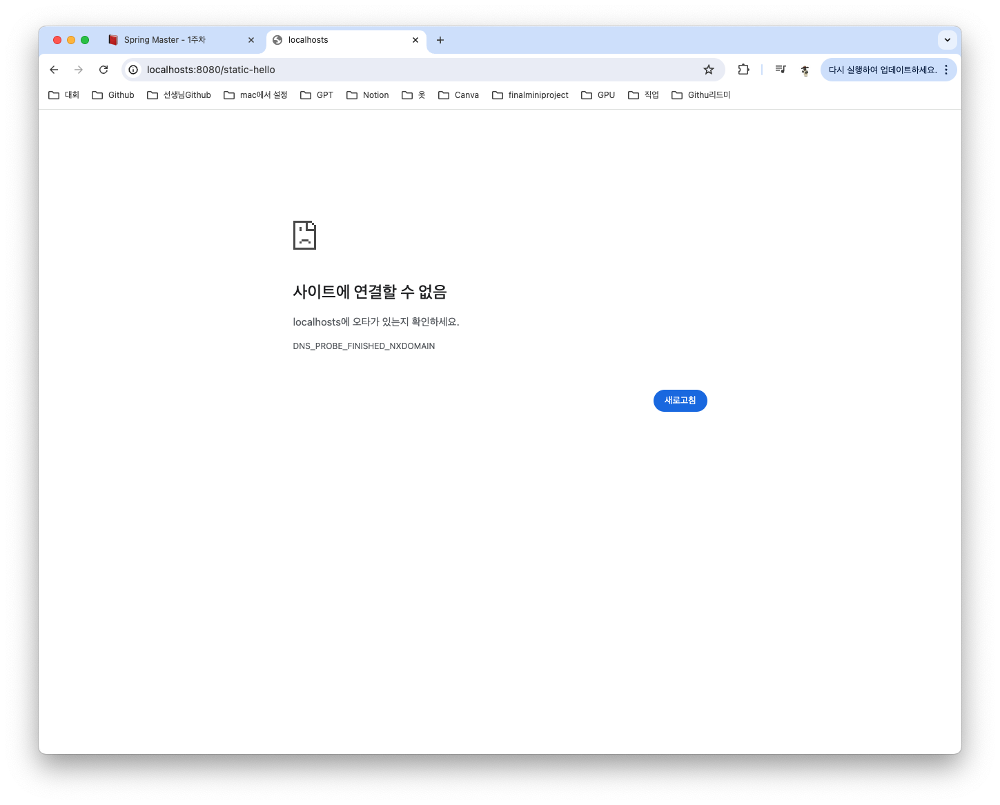
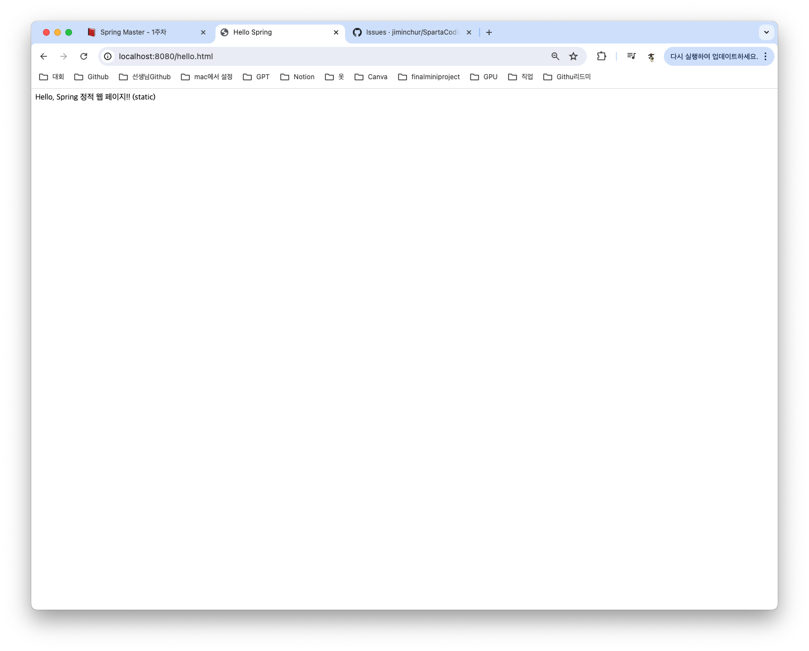
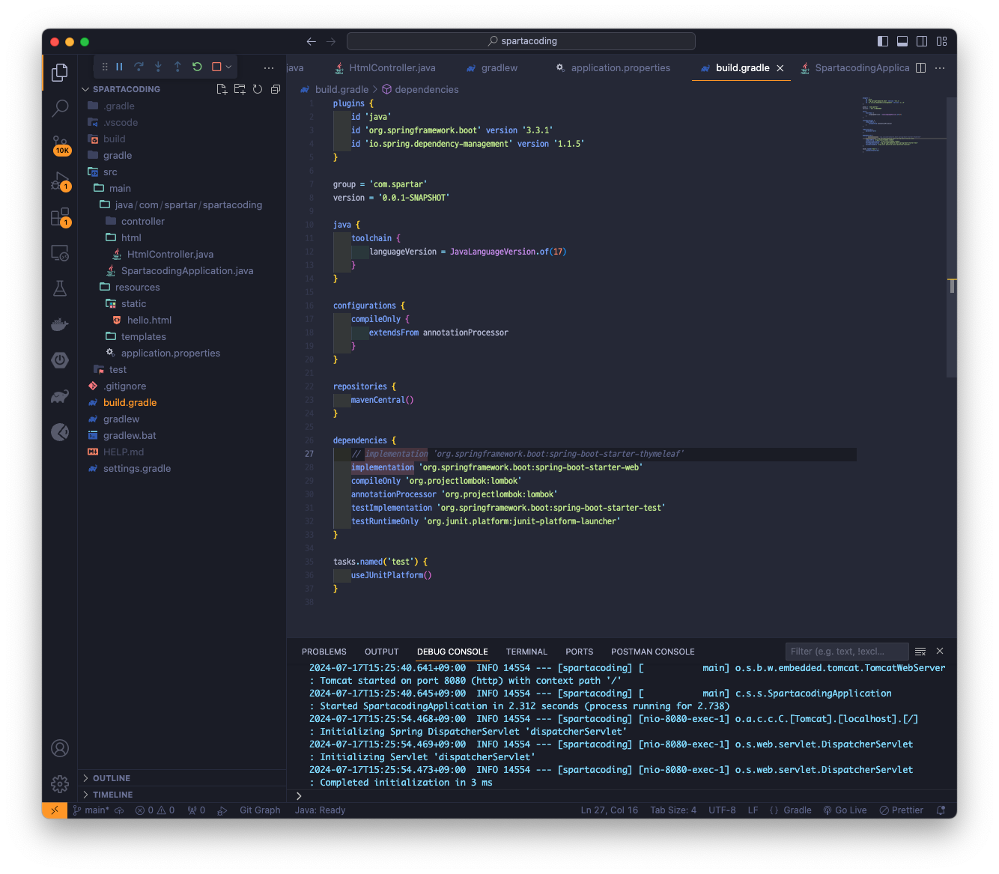
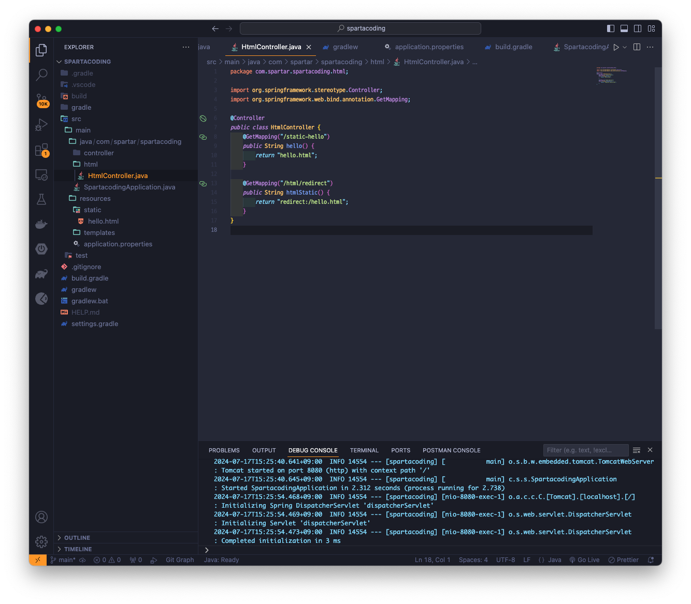
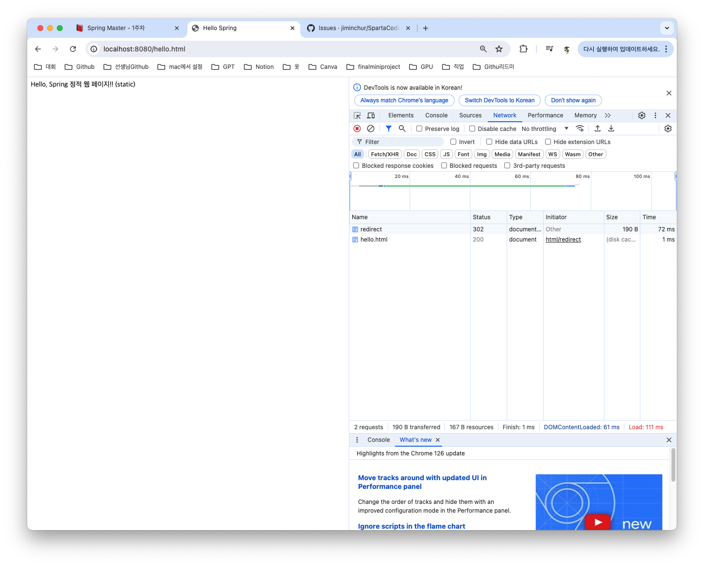
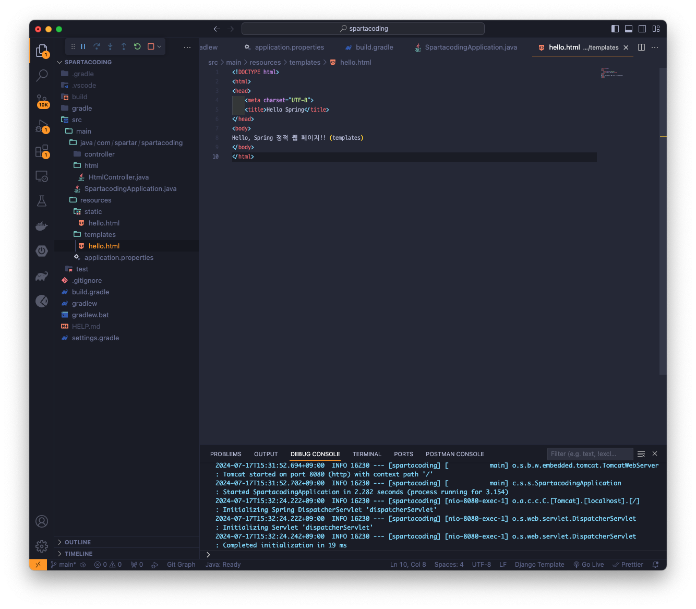
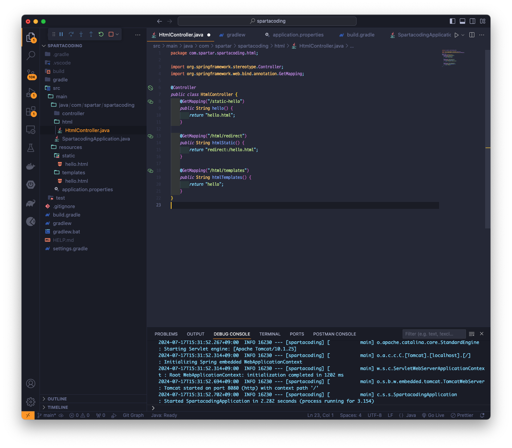
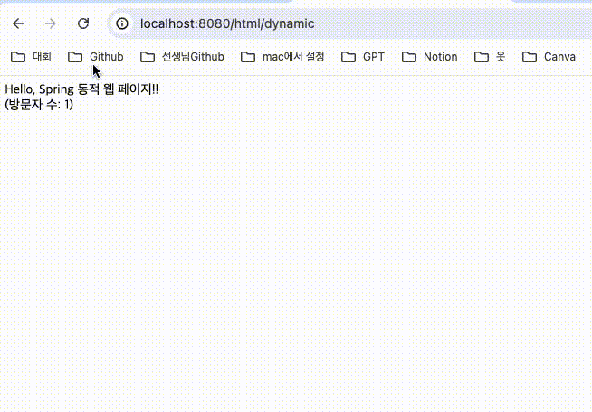

## Version 0.0.5
> 동적페이지 정적페이지 실습하기

### static폴더안에 hello.html파일 생성 및 코드작성하기


### html/HtmlController.java 파일 생성 및 아래코드 작성하기
```
@GetMapping("/static-hello")
public String hello() {
    return "hello.html";
}
```

### 실행 후 http://localhost:8080/static-hello로 test해보기
#### 실패 

* 이유
    * SpringBoot 서버에 html파일을 바로 요청하면 해당 html파일을 static폴더에서 찾아서 반환해준다. 그래서 controller를 거쳐서 반환을 할 필요가 없다. thyleaf부분을 주석을 치면 직접 접속이 가능하긴하다.
#### http://localhost:8080/hello.html로 접속하였을때


#### thyleaf부분 주석처리


#### http://localhost:8080/static-hell로 접속 재시도
##### 성공


### Redirect 실습하기
#### 코드

#### http://localhost:8080/html/redirect로 접속 시도


### templates폴더안에 hello.html파일 생성 및 코드작성하기


### 페이지 접속자 수를 보여주는 동적페이지 코드짜기


### http://localhost:8080/html/templates로 접속 후 테스트

